# 다이어그램 원본 — Mermaid

> 작성 2026-08-21 · **개정 2026-08-28** · 김현우(가시화) · 캡스톤 MK2
> 기준 `피지컬팀 프로젝트 mk2 요구사항 정의서.xlsx` 김현우 시트 **46건**
>
> **2026-08-27 개정** — 가시화의 성격이 바뀌었다
> - `AI-D-01`·`02`·`04` 삭제분을 인수해 **가시화가 임무를 만든다**(F15 · `VZ-G-01`~`05`)
>   → `DF-1a`의 「받아서 그린다」가 더는 맞지 않는다. **`DF-7` 신설**
> - 디버깅 실행 추적 신설(F14 · `VZ-D-01`~`08`) → `DF-7`
> - 두 도구를 한 앱으로 통합, **탭 6개 + 공유 계층** 구조 확정(정의서 §3.1) → `DF-7`
>
> **2026-08-24 개정** — 상대 계약 변경 반영
> - `AI-C-14`(데이터 유형별 경로 분리)로 **미디어가 세 번째 평면**이 됐다 → `DF-1a`·`DF-1b`
> - `HW-C-07`이 「MAC 주소 기반」 → 「고유 `device_id` 기반」으로 바뀌었다 → `T3` 2종
> - `HW-R-04` 재작성으로 온디바이스·엣지의 **인지 급이 갈렸다** → `DF-6` 신설
>
> **이 문서는 원본 소스입니다.** 아래 블록을 그대로 복사해 GitHub·Notion·mermaid.live 에 붙이면
> 렌더됩니다. 기존 조판본 중 계약이 바뀌지 않은 그림은 `reports/assets/`에 있습니다.
> **2026-08-28 조판 정리 완료 — 이제 모든 절에 조판본이 있습니다.**
> 재조판: `DF-1a` 전체 계통 · `T3` device_id 연결 변경 (8/24부터 대기하던 것).
> 신규 조판: `DF-1b` 세 평면 · `DF-6` 인지 결과의 두 갈래 (한 번도 조판된 적이 없었습니다).
> 8/21 구판(2평면 `DF-1`, MAC 기반 `T3`, 전체 데이터 흐름 구조도)은 `_archive/assets/`에 있습니다.
> 「전체 데이터 흐름 구조도」는 따로 만들지 않습니다 — `DF-1a`와 `DF-7`이 역할을 나눠 맡습니다.
>
> 다이어그램을 고칠 때는 **PNG가 아니라 이 파일을 고치고 다시 렌더**해야 합니다.

---

# 1. 전체 데이터 흐름

## DF-1a · 계통 · 입구 · 역방향  *(flowchart)*

> 조판본: `reports/assets/2026-08-28_흐름_DF-1a_전체계통.png`

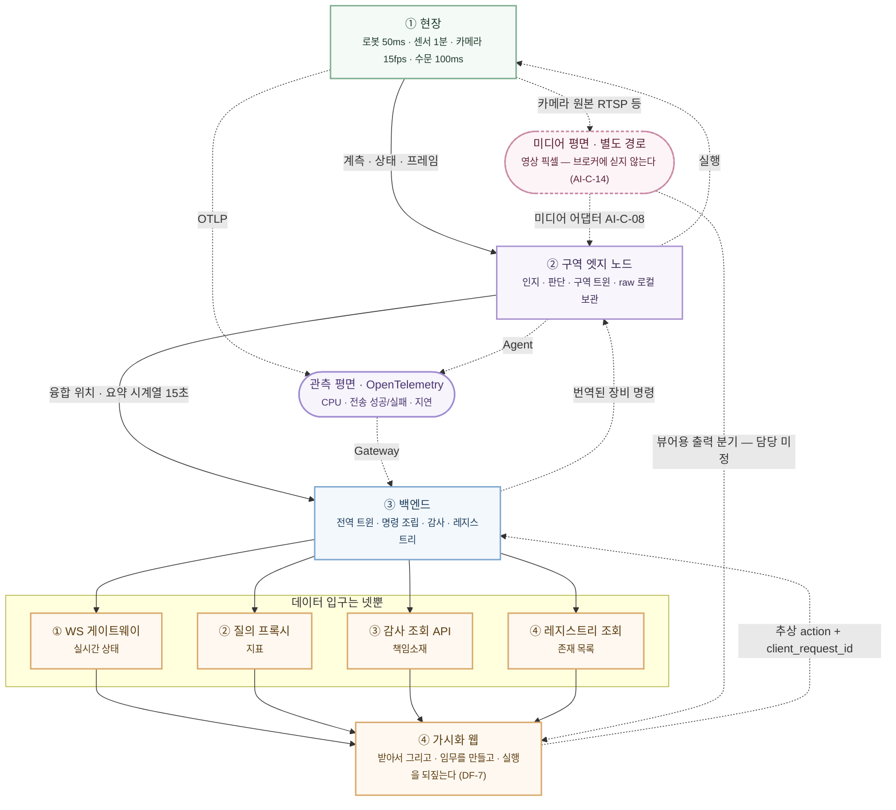
```mermaid
flowchart TB
    D["① 현장<br/><small>로봇 50ms · 센서 1분 · 카메라 15fps · 수문 100ms</small>"]
    E["② 구역 엣지 노드<br/><small>인지 · 판단 · 구역 트윈 · raw 로컬 보관</small>"]
    B["③ 백엔드<br/><small>전역 트윈 · 명령 조립 · 감사 · 레지스트리</small>"]
    V["④ 가시화 웹<br/><small>받아서 그리고 · 임무를 만들고 · 실행을 되짚는다 (DF-7)</small>"]

    D -->|계측 · 상태 · 프레임| E
    E -->|융합 위치 · 요약 시계열 15초| B
    B --> G1 & G2 & G3 & G4
    G1 & G2 & G3 & G4 --> V

    subgraph GATE[" 데이터 입구는 넷뿐 "]
        direction LR
        G1["① WS 게이트웨이<br/><small>실시간 상태</small>"]
        G2["② 질의 프록시<br/><small>지표</small>"]
        G3["③ 감사 조회 API<br/><small>책임소재</small>"]
        G4["④ 레지스트리 조회<br/><small>존재 목록</small>"]
    end

    V -.->|추상 action + client_request_id| B
    B -.->|번역된 장비 명령| E
    E -.->|실행| D

    O(["관측 평면 · OpenTelemetry<br/><small>CPU · 전송 성공/실패 · 지연</small>"])
    D -.->|OTLP| O
    E -.->|Agent| O
    O -.->|Gateway| B

    M(["미디어 평면 · 별도 경로<br/><small>영상 픽셀 — 브로커에 싣지 않는다 (AI-C-14)</small>"])
    D -.->|카메라 원본 RTSP 등| M
    M -.->|미디어 어댑터 AI-C-08| E
    M -.->|뷰어용 출력 분기 — 담당 미정| V

    classDef l1 fill:#f4faf6,stroke:#7fae90,stroke-width:2px,color:#1f3a2a
    classDef l2 fill:#f8f5fc,stroke:#a992d0,stroke-width:2px,color:#3a2a55
    classDef l3 fill:#f3f8fd,stroke:#7fa8d0,stroke-width:2px,color:#1c3d5c
    classDef l4 fill:#fef8f1,stroke:#d9a86a,stroke-width:2px,color:#5c3d0f
    classDef ob fill:#f7f4fc,stroke:#a08cd0,stroke-width:2px,color:#4a3570
    classDef md fill:#fdf4f7,stroke:#c98aa4,stroke-width:2px,color:#5c1f36,stroke-dasharray: 4 3
    class D l1
    class E l2
    class B l3
    class V,G1,G2,G3,G4 l4
    class O ob
    class M md
```

> **미디어 평면의 점선과 「담당 미정」이 이 그림의 요점입니다.** `AI-C-14`가 영상 픽셀을
> 업무·관측 경로에 싣지 말라고 못 박았고 `AI-C-08`이 원본 규격을 흡수하는 어댑터를 세웠지만,
> **미디어 경로에서 뷰어로 나가는 분기는 아직 아무 파트의 것도 아닙니다.** 실제 카메라를
> 붙이는 순간 여기서 막힙니다(회의 안건).

## DF-1b · 세 평면 — 같은 사건이 여러 곳에 남는 이유  *(sequence)*

> 조판본: `reports/assets/2026-08-28_흐름_DF-1b_세평면.png` (2026-08-28 신규 조판)

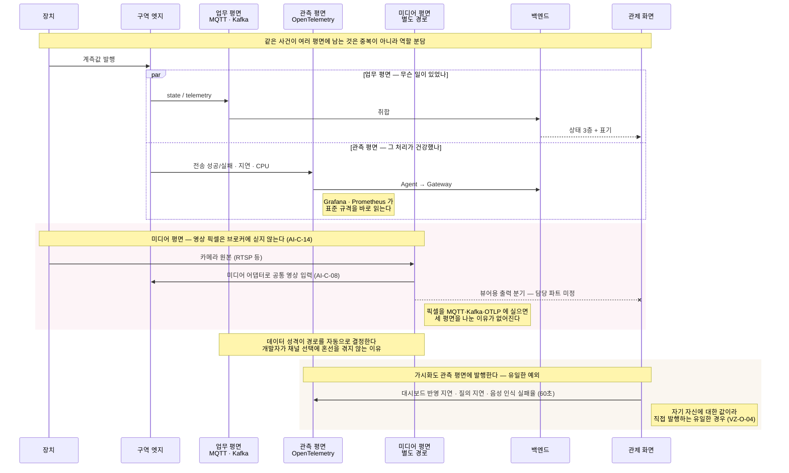
```mermaid
sequenceDiagram
    participant D as 장치
    participant E as 구역 엣지
    participant M as 업무 평면<br/>MQTT · Kafka
    participant T as 관측 평면<br/>OpenTelemetry
    participant X as 미디어 평면<br/>별도 경로
    participant B as 백엔드
    participant V as 관제 화면

    Note over D,V: 같은 사건이 여러 평면에 남는 것은 중복이 아니라 역할 분담

    D->>E: 계측값 발행
    par 업무 평면 — 무슨 일이 있었나
        E->>M: state / telemetry
        M->>B: 취합
        B-->>V: 상태 3층 + 표기
    and 관측 평면 — 그 처리가 건강했나
        E->>T: 전송 성공/실패 · 지연 · CPU
        T->>B: Agent → Gateway
        Note right of T: Grafana · Prometheus 가<br/>표준 규격을 바로 읽는다
    end

    rect rgb(253,244,247)
    Note over D,X: 미디어 평면 — 영상 픽셀은 브로커에 싣지 않는다 (AI-C-14)
    D->>X: 카메라 원본 (RTSP 등)
    X->>E: 미디어 어댑터로 공통 영상 입력 (AI-C-08)
    X--xV: 뷰어용 출력 분기 — 담당 파트 미정
    Note right of X: 픽셀을 MQTT·Kafka·OTLP 에 실으면<br/>세 평면을 나눈 이유가 없어진다
    end

    Note over M,X: 데이터 성격이 경로를 자동으로 결정한다<br/>개발자가 채널 선택에 혼선을 겪지 않는 이유

    rect rgb(250,246,240)
    Note over V,T: 가시화도 관측 평면에 발행한다 — 유일한 예외
    V->>T: 대시보드 반영 지연 · 질의 지연 · 음성 인식 실패율 (60초)
    Note right of V: 자기 자신에 대한 값이라<br/>직접 발행하는 유일한 경우 (VZ-O-04)
    end
```

## DF-2 · 계측값 하나의 일생 — 요약과 원본  *(sequence)*

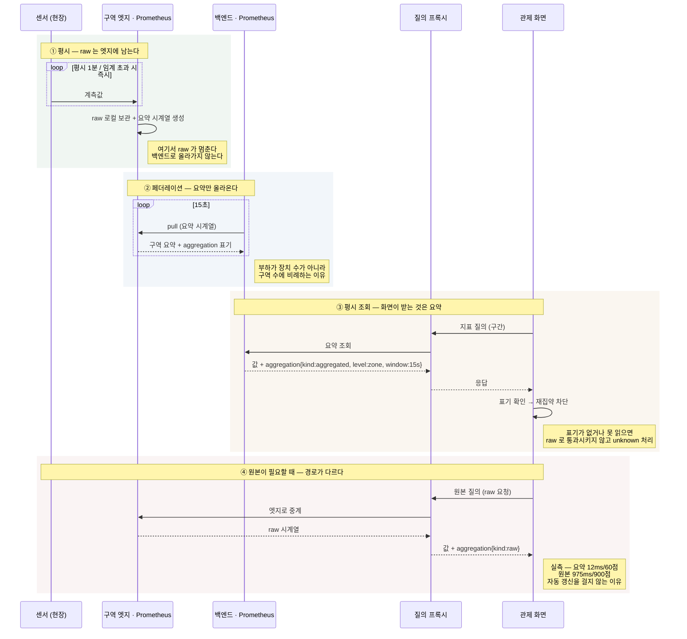
```mermaid
sequenceDiagram
    participant D as 센서 (현장)
    participant E as 구역 엣지 · Prometheus
    participant B as 백엔드 · Prometheus
    participant P as 질의 프록시
    participant V as 관제 화면

    rect rgb(240,246,242)
    Note over D,E: ① 평시 — raw 는 엣지에 남는다
    loop 평시 1분 / 임계 초과 시 즉시
        D->>E: 계측값
    end
    E->>E: raw 로컬 보관 + 요약 시계열 생성
    Note right of E: 여기서 raw 가 멈춘다<br/>백엔드로 올라가지 않는다
    end

    rect rgb(242,246,250)
    Note over E,B: ② 페더레이션 — 요약만 올라온다
    loop 15초
        B->>E: pull (요약 시계열)
        E-->>B: 구역 요약 + aggregation 표기
    end
    Note right of B: 부하가 장치 수가 아니라<br/>구역 수에 비례하는 이유
    end

    rect rgb(250,246,240)
    Note over V,B: ③ 평시 조회 — 화면이 받는 것은 요약
    V->>P: 지표 질의 (구간)
    P->>B: 요약 조회
    B-->>P: 값 + aggregation{kind:aggregated, level:zone, window:15s}
    P-->>V: 응답
    V->>V: 표기 확인 → 재집약 차단
    Note right of V: 표기가 없거나 못 읽으면<br/>raw 로 통과시키지 않고 unknown 처리
    end

    rect rgb(250,244,244)
    Note over V,D: ④ 원본이 필요할 때 — 경로가 다르다
    V->>P: 원본 질의 (raw 요청)
    P->>E: 엣지로 중계
    E-->>P: raw 시계열
    P-->>V: 값 + aggregation{kind:raw}
    Note right of V: 실측 — 요약 12ms/60점<br/>원본 975ms/900점<br/>자동 갱신을 걸지 않는 이유
    end
```

## DF-3 · 명령 하나의 일생 — 두 개의 키  *(sequence)*

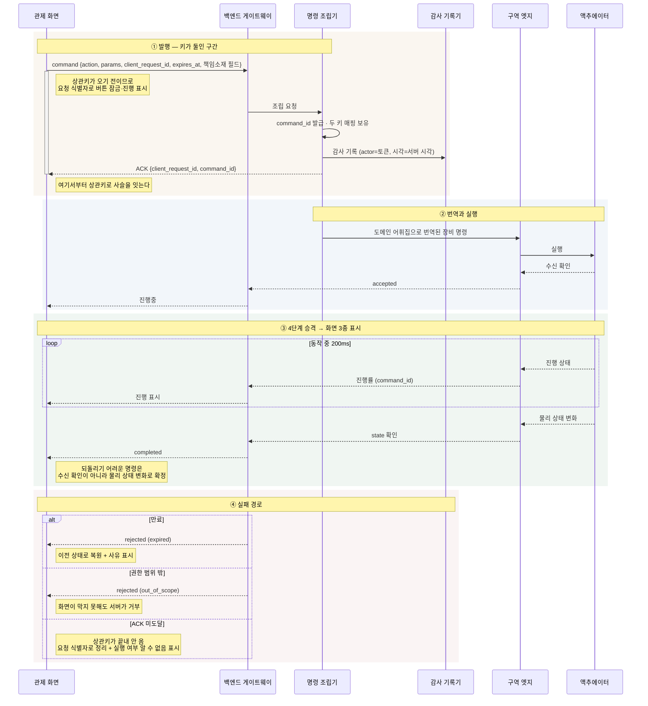
```mermaid
sequenceDiagram
    participant V as 관제 화면
    participant G as 백엔드 게이트웨이
    participant X as 명령 조립기
    participant A as 감사 기록기
    participant E as 구역 엣지
    participant D as 액추에이터

    rect rgb(250,246,240)
    Note over V,X: ① 발행 — 키가 둘인 구간
    V->>G: command {action, params, client_request_id, expires_at, 책임소재 필드}
    activate V
    Note right of V: 상관키가 오기 전이므로<br/>요청 식별자로 버튼 잠금·진행 표시
    G->>X: 조립 요청
    X->>X: command_id 발급 · 두 키 매핑 보유
    X->>A: 감사 기록 (actor=토큰, 시각=서버 시각)
    X-->>V: ACK {client_request_id, command_id}
    deactivate V
    Note right of V: 여기서부터 상관키로 사슬을 잇는다
    end

    rect rgb(242,246,250)
    Note over X,D: ② 번역과 실행
    X->>E: 도메인 어휘집으로 번역된 장비 명령
    E->>D: 실행
    D-->>E: 수신 확인
    E-->>G: accepted
    G-->>V: 진행중
    end

    rect rgb(240,246,242)
    Note over D,V: ③ 4단계 승격 → 화면 3종 표시
    loop 동작 중 200ms
        D-->>E: 진행 상태
        E-->>G: 진행률 (command_id)
        G-->>V: 진행 표시
    end
    D-->>E: 물리 상태 변화
    E-->>G: state 확인
    G-->>V: completed
    Note right of V: 되돌리기 어려운 명령은<br/>수신 확인이 아니라 물리 상태 변화로 확정
    end

    rect rgb(250,244,244)
    Note over V,A: ④ 실패 경로
    alt 만료
        G-->>V: rejected (expired)
        Note right of V: 이전 상태로 복원 + 사유 표시
    else 권한 범위 밖
        G-->>V: rejected (out_of_scope)
        Note right of V: 화면이 막지 못해도 서버가 거부
    else ACK 미도달
        Note right of V: 상관키가 끝내 안 옴<br/>요청 식별자로 정리 + 실행 여부 알 수 없음 표시
    end
    end
```

## DF-4 · 대상 하나의 상태 — 3층에서 4종으로  *(state)*

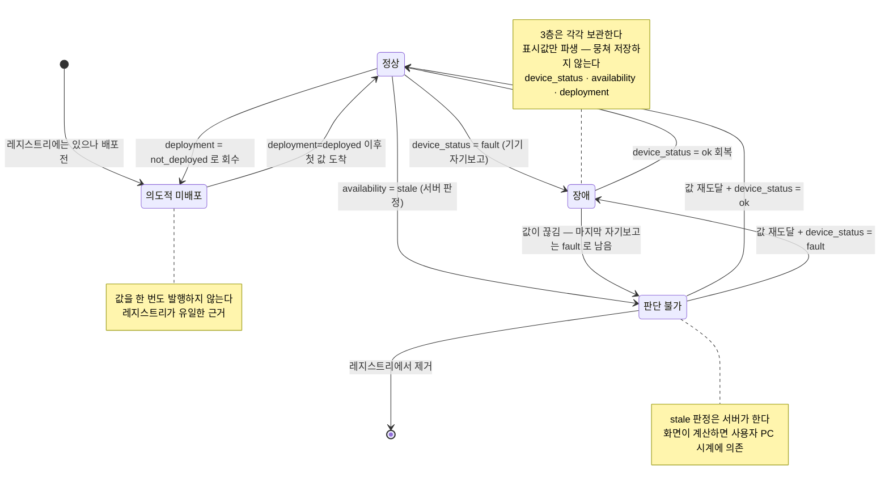
```mermaid
stateDiagram-v2
    state "정상" as OK
    state "장애" as FAULT
    state "의도적 미배포" as NOTDEP
    state "판단 불가" as UNKNOWN

    [*] --> NOTDEP : 레지스트리에는 있으나 배포 전
    NOTDEP --> OK : deployment=deployed 이후 첫 값 도착
    OK --> FAULT : device_status = fault (기기 자기보고)
    FAULT --> OK : device_status = ok 회복
    OK --> UNKNOWN : availability = stale (서버 판정)
    FAULT --> UNKNOWN : 값이 끊김 — 마지막 자기보고는 fault 로 남음
    UNKNOWN --> OK : 값 재도달 + device_status = ok
    UNKNOWN --> FAULT : 값 재도달 + device_status = fault
    OK --> NOTDEP : deployment = not_deployed 로 회수
    UNKNOWN --> [*] : 레지스트리에서 제거

    note right of NOTDEP
        값을 한 번도 발행하지 않는다
        레지스트리가 유일한 근거
    end note
    note right of UNKNOWN
        stale 판정은 서버가 한다
        화면이 계산하면 사용자 PC 시계에 의존
    end note
    note left of FAULT
        3층은 각각 보관한다
        표시값만 파생 — 뭉쳐 저장하지 않는다
        device_status · availability · deployment
    end note
```

## DF-5 · 계획 승인 — 누가 나르는가  *(sequence)*

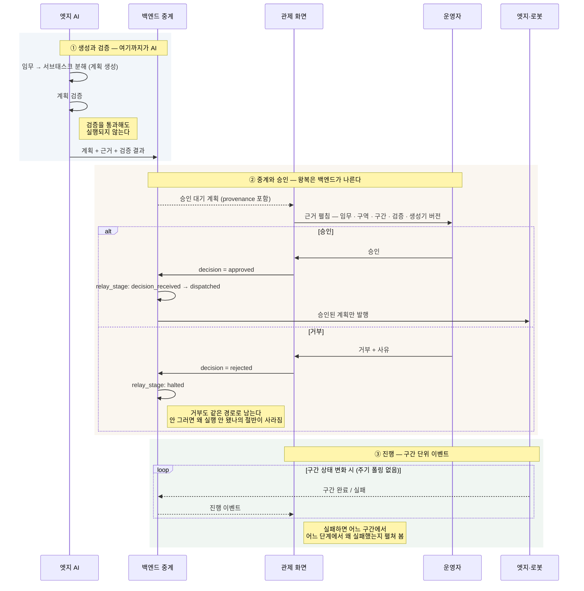
```mermaid
sequenceDiagram
    participant AI as 엣지 AI
    participant B as 백엔드 중계
    participant V as 관제 화면
    participant U as 운영자
    participant E as 엣지·로봇

    rect rgb(242,246,250)
    Note over AI,B: ① 생성과 검증 — 여기까지가 AI
    AI->>AI: 임무 → 서브태스크 분해 (계획 생성)
    AI->>AI: 계획 검증
    Note right of AI: 검증을 통과해도<br/>실행되지 않는다
    AI->>B: 계획 + 근거 + 검증 결과
    end

    rect rgb(250,246,240)
    Note over B,U: ② 중계와 승인 — 왕복은 백엔드가 나른다
    B-->>V: 승인 대기 계획 (provenance 포함)
    V->>U: 근거 펼침 — 임무 · 구역 · 구간 · 검증 · 생성기 버전
    alt 승인
        U->>V: 승인
        V->>B: decision = approved
        B->>B: relay_stage: decision_received → dispatched
        B->>E: 승인된 계획만 발행
    else 거부
        U->>V: 거부 + 사유
        V->>B: decision = rejected
        B->>B: relay_stage: halted
        Note right of B: 거부도 같은 경로로 남는다<br/>안 그러면 왜 실행 안 됐나의 절반이 사라짐
    end
    end

    rect rgb(240,246,242)
    Note over E,V: ③ 진행 — 구간 단위 이벤트
    loop 구간 상태 변화 시 (주기 폴링 없음)
        E-->>B: 구간 완료 / 실패
        B-->>V: 진행 이벤트
    end
    Note right of V: 실패하면 어느 구간에서<br/>어느 단계에서 왜 실패했는지 펼쳐 봄
    end
```

## DF-6 · 인지 결과의 두 갈래 — 급이 다르다  *(sequence)*

> 조판본: `reports/assets/2026-08-28_흐름_DF-6_인지결과_두갈래.png` (2026-08-28 신규 조판)

> `HW-R-04` 재작성 반영. 로봇 온보드는 **Raspberry Pi와 카메라뿐**이라 metric distance
> 센서를 전제하지 않는다. 그래서 온디바이스는 진행영역·접근 변화 같은 **최소 안전 판단**만
> 하고, 정밀 분류·추적은 엣지 AI에서 온다. 화면은 두 결과를 **출처를 구분해** 그려야 한다.

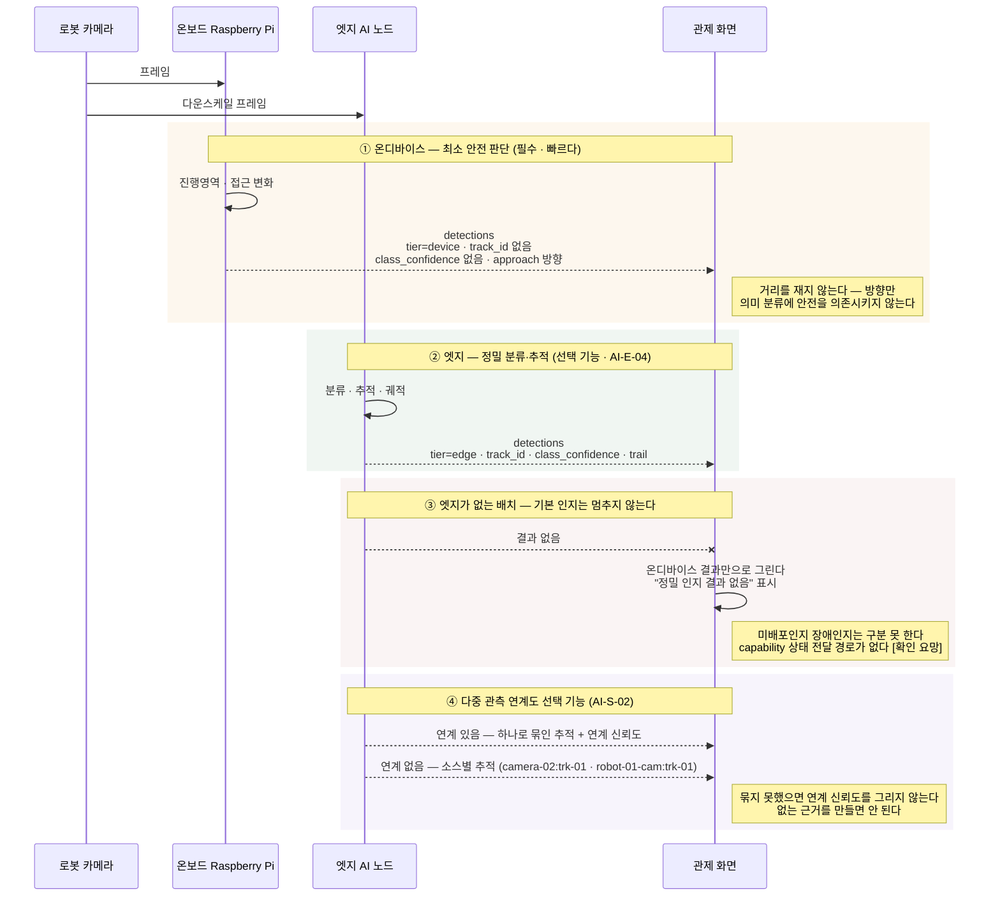
```mermaid
sequenceDiagram
    participant C as 로봇 카메라
    participant P as 온보드 Raspberry Pi
    participant EA as 엣지 AI 노드
    participant V as 관제 화면

    C->>P: 프레임
    C->>EA: 다운스케일 프레임

    rect rgb(253,247,238)
    Note over P,V: ① 온디바이스 — 최소 안전 판단 (필수 · 빠르다)
    P->>P: 진행영역 · 접근 변화
    P-->>V: detections<br/>tier=device · track_id 없음<br/>class_confidence 없음 · approach 방향
    Note right of V: 거리를 재지 않는다 — 방향만<br/>의미 분류에 안전을 의존시키지 않는다
    end

    rect rgb(240,246,242)
    Note over EA,V: ② 엣지 — 정밀 분류·추적 (선택 기능 · AI-E-04)
    EA->>EA: 분류 · 추적 · 궤적
    EA-->>V: detections<br/>tier=edge · track_id · class_confidence · trail
    end

    rect rgb(250,244,244)
    Note over EA,V: ③ 엣지가 없는 배치 — 기본 인지는 멈추지 않는다
    EA--xV: 결과 없음
    V->>V: 온디바이스 결과만으로 그린다<br/>"정밀 인지 결과 없음" 표시
    Note right of V: 미배포인지 장애인지는 구분 못 한다<br/>capability 상태 전달 경로가 없다 [확인 요망]
    end

    rect rgb(247,244,252)
    Note over EA,V: ④ 다중 관측 연계도 선택 기능 (AI-S-02)
    EA-->>V: 연계 있음 — 하나로 묶인 추적 + 연계 신뢰도
    EA-->>V: 연계 없음 — 소스별 추적 (camera-02:trk-01 · robot-01-cam:trk-01)
    Note right of V: 묶지 못했으면 연계 신뢰도를 그리지 않는다<br/>없는 근거를 만들면 안 된다
    end
```

> **이 그림이 막는 사고**: 두 결과를 같은 모양으로 그리면 관제사가 거친 판단을 정밀 판단으로
> 읽는다. "0.9면 확실하다"를 두 출처에 똑같이 적용하게 되고, 온디바이스에는 애초에
> 분류 신뢰도가 없다.

---

## DF-7 · 가시화 웹 중심 — 받고 · 만들고 · 내보낸다  *(flowchart, 2026-08-27 신설)*

> `DF-1a`가 전체 계통에서 가시화를 **한 박스**로 뒀다면, 이 그림은 그 박스를 **열어** 본 것이다.
> 조판본: `reports/assets/2026-08-27_데이터흐름_DF-7_가시화웹중심.png` (2026-08-28 탭 번호 개정 반영)
>
> 탭 상자에는 번호를 적지 않는다. 이 그림의 주제는 흐름이고, 번호는 요구사항정의서 §3.1이 원천이다.

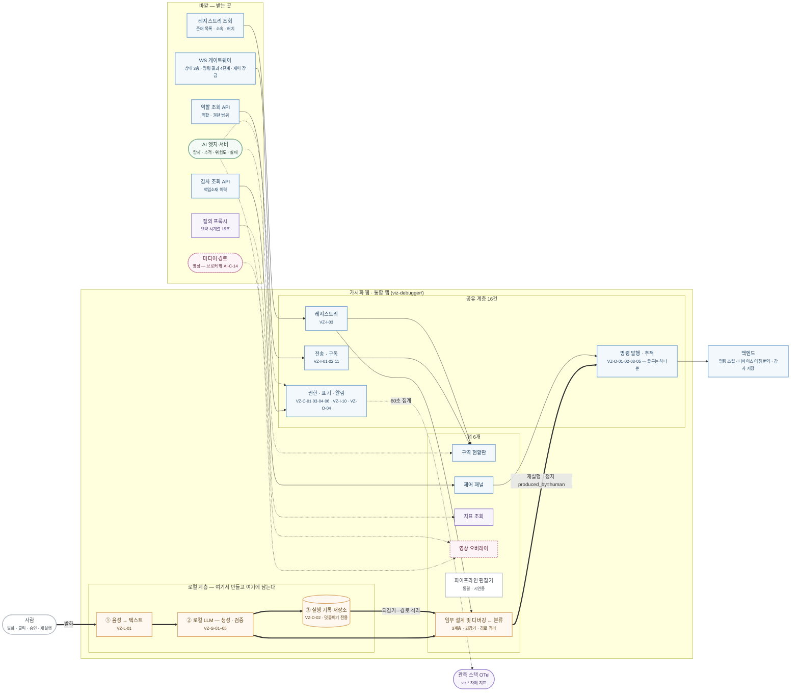
```mermaid
flowchart LR
    subgraph IN[" 바깥 — 받는 곳 "]
        direction TB
        G1["WS 게이트웨이<br/><small>상태 3층 · 명령 결과 4단계 · 제어 잠금</small>"]
        G4["레지스트리 조회<br/><small>존재 목록 · 소속 · 배치</small>"]
        G5["역할 조회 API<br/><small>역할 · 권한 범위</small>"]
        G2["질의 프록시<br/><small>요약 시계열 15초</small>"]
        G3["감사 조회 API<br/><small>책임소재 이력</small>"]
        MD(["미디어 경로<br/><small>영상 — 브로커 밖 AI-C-14</small>"])
        AIX(["AI 엣지·서버<br/><small>탐지 · 추적 · 위험도 · 실패</small>"])
    end

    subgraph APP[" 가시화 웹 · 통합 앱 (viz-debugger/) "]
        direction TB
        subgraph SH[" 공유 계층 16건 "]
            direction TB
            S1["전송 · 구독<br/><small>VZ-I-01·02·11</small>"]
            S2["레지스트리<br/><small>VZ-I-03</small>"]
            S3["명령 발행 · 추적<br/><small>VZ-O-01·02·03·05 — 출구는 하나뿐</small>"]
            S4["권한 · 표기 · 알림<br/><small>VZ-C-01·03·04·06 · VZ-I-10 · VZ-O-04</small>"]
        end
        subgraph TABS[" 탭 6개 "]
            direction LR
            T1["구역 현황판"]
            T2["제어 패널"]
            T3["지표 조회"]
            T4["영상 오버레이"]
            T5["파이프라인 편집기<br/><small>동결 · 시연용</small>"]
            T6["임무 설계 및 디버깅 ← 본류<br/><small>3계층 · 되감기 · 경로 격리</small>"]
        end
        subgraph LOC[" 로컬 계층 — 여기서 만들고 여기에 남는다 "]
            direction LR
            L1["① 음성 → 텍스트<br/><small>VZ-L-01</small>"]
            L2["② 로컬 LLM — 생성 · 검증<br/><small>VZ-G-01~05</small>"]
            L3[("③ 실행 기록 저장소<br/><small>VZ-D-02 · 덧붙이기 전용</small>")]
        end
    end

    U(["사람<br/><small>발화 · 클릭 · 승인 · 재실행</small>"])
    BE["백엔드<br/><small>명령 조립 · 디바이스 어휘 번역 · 감사 저장</small>"]
    OT(["관측 스택 OTel<br/><small>viz.* 자체 지표</small>"])

    G1 --> S1
    G4 --> S2
    G5 --> S4
    G2 -.-> T3
    G3 --> T2
    MD -.-> T4
    AIX -.-> T4
    AIX -.-> T1
    AIX -.-> S4

    S1 --> T1
    S2 --> T1
    S2 --> T6

    U ==>|발화| L1
    L1 ==> L2
    L2 ==> L3
    L2 ==> T6
    L3 ==>|되감기 · 경로 격리| T6

    T6 ==>|재실행 · 정지 produced_by=human| S3
    T2 --> S3
    S3 --> BE
    S4 -.->|60초 집계| OT

    classDef work fill:#f3f8fd,stroke:#7fa8d0,stroke-width:2px,color:#1c3d5c
    classDef obs  fill:#f7f4fc,stroke:#a08cd0,stroke-width:2px,color:#4a3570
    classDef med  fill:#fdf4f7,stroke:#c98aa4,stroke-width:2px,color:#5c1f36,stroke-dasharray: 4 3
    classDef ai   fill:#f4faf6,stroke:#7fae90,stroke-width:2px,color:#1f3a2a
    classDef loc  fill:#fef8f1,stroke:#d9a86a,stroke-width:2px,color:#5c3d0f
    classDef you  fill:#ffffff,stroke:#b6bcc3,stroke-width:2px,color:#3f4650
    class G1,G3,G4,G5,S1,S2,S3,S4,T1,T2,BE work
    class G2,T3,OT obs
    class MD,T4 med
    class AIX ai
    class L1,L2,L3,T6 loc
    class U,T5 you
```

**이 그림이 말하는 것 넷.**

1. **「받아서 그린다」가 끝났다.** 발화에서 마일스톤·태스크를 만드는 것이 앱 안에 있다(F15).
   그래서 굵은 화살표 — 발화 → 생성 → 실행 → 기록 → 되감기 — 가 바깥으로 나가지 않고 안에서 닫힌다.
2. **바깥 출구는 둘뿐이다.** 명령(업무 평면)과 자체 관측 지표(관측 평면).
3. **명령 출구는 하나여야 한다.** 탭③의 수동 제어와 탭①의 재실행이 같은 `S3`을 쓴다.
   갈라지면 트레이스가 나뉘어 `produced_by=human` 기록이 한쪽에만 남는다.
4. **실행 기록은 앱 안에만 있다.** 되감기(`VZ-D-04`)와 경로 격리(`VZ-D-05`)가 이 저장소 위의
   계산이라 바깥 왕복이 없다 — 임의 시점 복원 16 ms 목표가 성립하는 이유다.

---

# 2. 연결 모드

## T1 · 서버 연결 — 중앙 관제  *(state)*

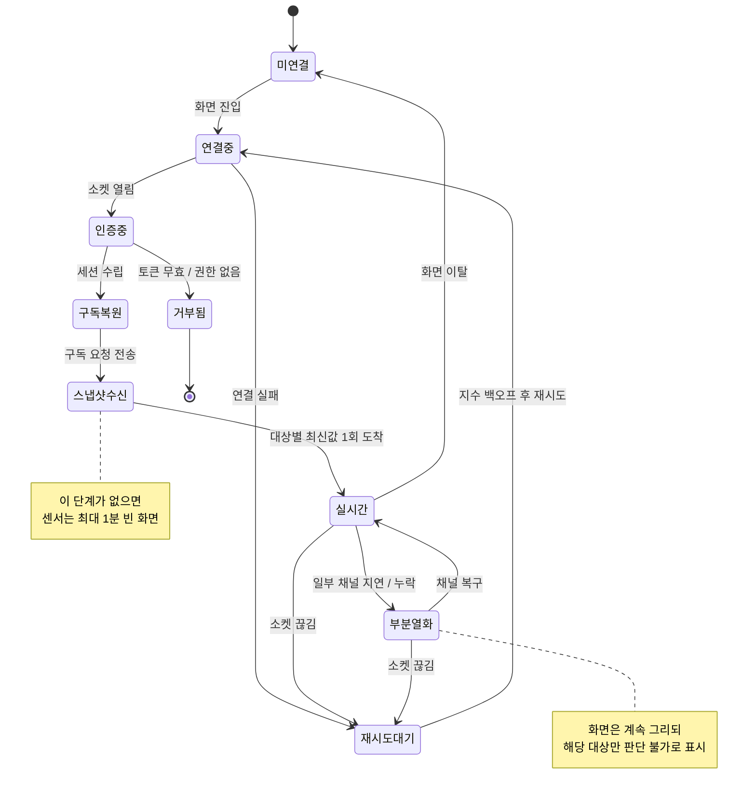
```mermaid
stateDiagram-v2
    [*] --> 미연결
    미연결 --> 연결중 : 화면 진입
    연결중 --> 인증중 : 소켓 열림
    연결중 --> 재시도대기 : 연결 실패
    인증중 --> 거부됨 : 토큰 무효 / 권한 없음
    인증중 --> 구독복원 : 세션 수립
    구독복원 --> 스냅샷수신 : 구독 요청 전송
    스냅샷수신 --> 실시간 : 대상별 최신값 1회 도착
    실시간 --> 부분열화 : 일부 채널 지연 / 누락
    부분열화 --> 실시간 : 채널 복구
    실시간 --> 재시도대기 : 소켓 끊김
    부분열화 --> 재시도대기 : 소켓 끊김
    재시도대기 --> 연결중 : 지수 백오프 후 재시도
    거부됨 --> [*]
    실시간 --> 미연결 : 화면 이탈
    note right of 스냅샷수신
        이 단계가 없으면
        센서는 최대 1분 빈 화면
    end note
    note right of 부분열화
        화면은 계속 그리되
        해당 대상만 판단 불가로 표시
    end note
```

## T1 · 서버 연결 — 중앙 관제  *(sequence)*

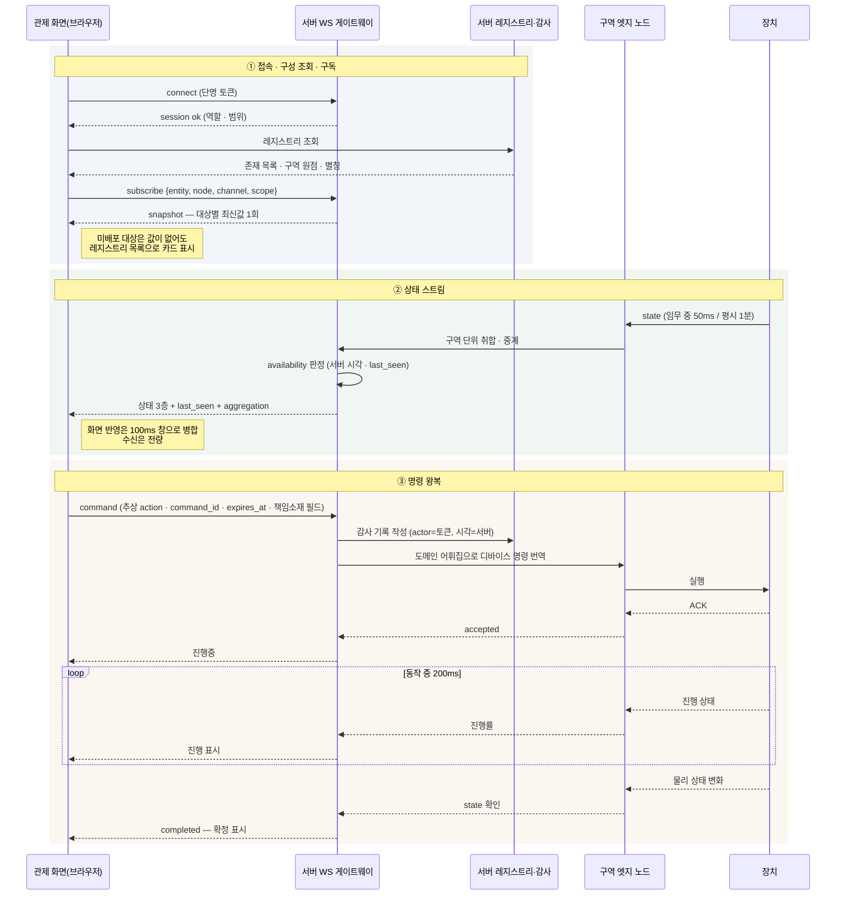
```mermaid
sequenceDiagram
    participant V as 관제 화면(브라우저)
    participant G as 서버 WS 게이트웨이
    participant R as 서버 레지스트리·감사
    participant E as 구역 엣지 노드
    participant D as 장치

    rect rgb(242,246,250)
    Note over V,R: ① 접속 · 구성 조회 · 구독
    V->>G: connect (단명 토큰)
    G-->>V: session ok (역할 · 범위)
    V->>R: 레지스트리 조회
    R-->>V: 존재 목록 · 구역 원점 · 별칭
    V->>G: subscribe {entity, node, channel, scope}
    G-->>V: snapshot — 대상별 최신값 1회
    Note right of V: 미배포 대상은 값이 없어도<br/>레지스트리 목록으로 카드 표시
    end

    rect rgb(240,246,242)
    Note over D,V: ② 상태 스트림
    D->>E: state (임무 중 50ms / 평시 1분)
    E->>G: 구역 단위 취합 · 중계
    G->>G: availability 판정 (서버 시각 · last_seen)
    G-->>V: 상태 3층 + last_seen + aggregation
    Note right of V: 화면 반영은 100ms 창으로 병합<br/>수신은 전량
    end

    rect rgb(250,246,240)
    Note over V,D: ③ 명령 왕복
    V->>G: command (추상 action · command_id · expires_at · 책임소재 필드)
    G->>R: 감사 기록 작성 (actor=토큰, 시각=서버)
    G->>E: 도메인 어휘집으로 디바이스 명령 번역
    E->>D: 실행
    D-->>E: ACK
    E-->>G: accepted
    G-->>V: 진행중
    loop 동작 중 200ms
        D-->>E: 진행 상태
        E-->>G: 진행률
        G-->>V: 진행 표시
    end
    D-->>E: 물리 상태 변화
    E-->>G: state 확인
    G-->>V: completed — 확정 표시
    end
```

## T2 · 엣지 노드 연결 — 구역 국지  *(state)*

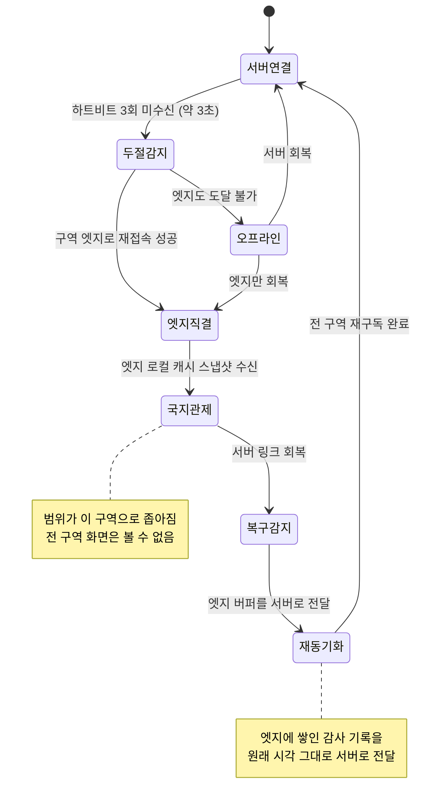
```mermaid
stateDiagram-v2
    [*] --> 서버연결
    서버연결 --> 두절감지 : 하트비트 3회 미수신 (약 3초)
    두절감지 --> 엣지직결 : 구역 엣지로 재접속 성공
    두절감지 --> 오프라인 : 엣지도 도달 불가
    엣지직결 --> 국지관제 : 엣지 로컬 캐시 스냅샷 수신
    국지관제 --> 복구감지 : 서버 링크 회복
    복구감지 --> 재동기화 : 엣지 버퍼를 서버로 전달
    재동기화 --> 서버연결 : 전 구역 재구독 완료
    오프라인 --> 엣지직결 : 엣지만 회복
    오프라인 --> 서버연결 : 서버 회복
    note right of 국지관제
        범위가 이 구역으로 좁아짐
        전 구역 화면은 볼 수 없음
    end note
    note right of 재동기화
        엣지에 쌓인 감사 기록을
        원래 시각 그대로 서버로 전달
    end note
```

## T2 · 엣지 노드 연결 — 구역 국지  *(sequence)*

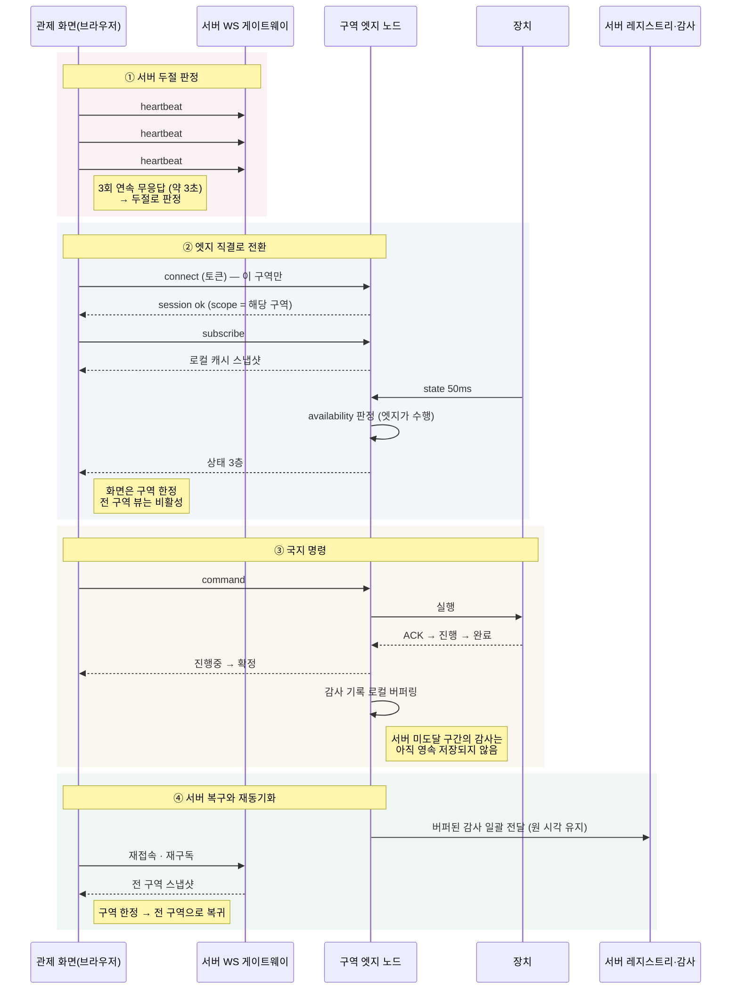
```mermaid
sequenceDiagram
    participant V as 관제 화면(브라우저)
    participant G as 서버 WS 게이트웨이
    participant E as 구역 엣지 노드
    participant D as 장치
    participant R as 서버 레지스트리·감사

    rect rgb(250,242,242)
    Note over V,G: ① 서버 두절 판정
    V->>G: heartbeat
    V->>G: heartbeat
    V->>G: heartbeat
    Note right of V: 3회 연속 무응답 (약 3초)<br/>→ 두절로 판정
    end

    rect rgb(242,246,250)
    Note over V,E: ② 엣지 직결로 전환
    V->>E: connect (토큰) — 이 구역만
    E-->>V: session ok (scope = 해당 구역)
    V->>E: subscribe
    E-->>V: 로컬 캐시 스냅샷
    D->>E: state 50ms
    E->>E: availability 판정 (엣지가 수행)
    E-->>V: 상태 3층
    Note right of V: 화면은 구역 한정<br/>전 구역 뷰는 비활성
    end

    rect rgb(250,246,240)
    Note over V,D: ③ 국지 명령
    V->>E: command
    E->>D: 실행
    D-->>E: ACK → 진행 → 완료
    E-->>V: 진행중 → 확정
    E->>E: 감사 기록 로컬 버퍼링
    Note right of E: 서버 미도달 구간의 감사는<br/>아직 영속 저장되지 않음
    end

    rect rgb(240,246,242)
    Note over E,V: ④ 서버 복구와 재동기화
    E->>R: 버퍼된 감사 일괄 전달 (원 시각 유지)
    V->>G: 재접속 · 재구독
    G-->>V: 전 구역 스냅샷
    Note right of V: 구역 한정 → 전 구역으로 복귀
    end
```

## T3 · `device_id` 기반 연결 변경  *(state)*

> 조판본: `reports/assets/2026-08-28_연결모드_T3_device_id_연결변경.png` (아래 sequence와 한 장)

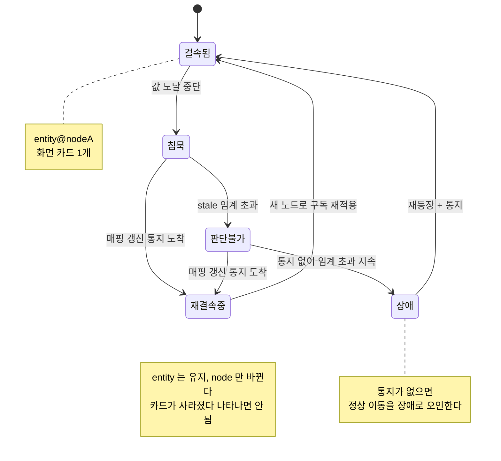
```mermaid
stateDiagram-v2
    [*] --> 결속됨
    결속됨 --> 침묵 : 값 도달 중단
    침묵 --> 판단불가 : stale 임계 초과
    침묵 --> 재결속중 : 매핑 갱신 통지 도착
    판단불가 --> 재결속중 : 매핑 갱신 통지 도착
    재결속중 --> 결속됨 : 새 노드로 구독 재적용
    판단불가 --> 장애 : 통지 없이 임계 초과 지속
    장애 --> 결속됨 : 재등장 + 통지
    note right of 결속됨
        entity@nodeA
        화면 카드 1개
    end note
    note right of 재결속중
        entity 는 유지, node 만 바뀐다
        카드가 사라졌다 나타나면 안 됨
    end note
    note right of 장애
        통지가 없으면
        정상 이동을 장애로 오인한다
    end note
```

## T3 · `device_id` 기반 연결 변경  *(sequence)*

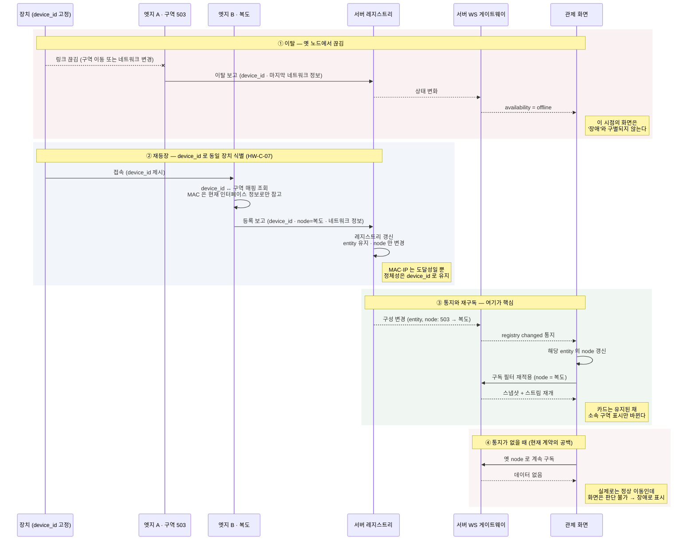
```mermaid
sequenceDiagram
    participant D as 장치 (device_id 고정)
    participant EA as 엣지 A · 구역 503
    participant EB as 엣지 B · 복도
    participant R as 서버 레지스트리
    participant G as 서버 WS 게이트웨이
    participant V as 관제 화면

    rect rgb(250,242,242)
    Note over D,V: ① 이탈 — 옛 노드에서 끊김
    D--xEA: 링크 끊김 (구역 이동 또는 네트워크 변경)
    EA->>R: 이탈 보고 (device_id · 마지막 네트워크 정보)
    R-->>G: 상태 변화
    G-->>V: availability = offline
    Note right of V: 이 시점의 화면은<br/>'장애'와 구별되지 않는다
    end

    rect rgb(242,246,250)
    Note over D,R: ② 재등장 — device_id 로 동일 장치 식별 (HW-C-07)
    D->>EB: 접속 (device_id 제시)
    EB->>EB: device_id ↔ 구역 매핑 조회<br/>MAC 은 현재 인터페이스 정보로만 참고
    EB->>R: 등록 보고 (device_id · node=복도 · 네트워크 정보)
    R->>R: 레지스트리 갱신<br/>entity 유지 · node 만 변경
    Note right of R: MAC·IP 는 도달성일 뿐<br/>정체성은 device_id 로 유지
    end

    rect rgb(240,246,242)
    Note over R,V: ③ 통지와 재구독 — 여기가 핵심
    R-->>G: 구성 변경 (entity, node: 503 → 복도)
    G-->>V: registry changed 통지
    V->>V: 해당 entity 의 node 갱신
    V->>G: 구독 필터 재적용 (node = 복도)
    G-->>V: 스냅샷 + 스트림 재개
    Note right of V: 카드는 유지된 채<br/>소속 구역 표시만 바뀐다
    end

    rect rgb(250,244,244)
    Note over V,G: ④ 통지가 없을 때 (현재 계약의 공백)
    V->>G: 옛 node 로 계속 구독
    G-->>V: 데이터 없음
    Note right of V: 실제로는 정상 이동인데<br/>화면은 판단 불가 → 장애로 표시
    end
```
