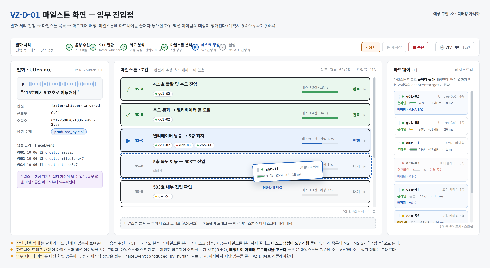
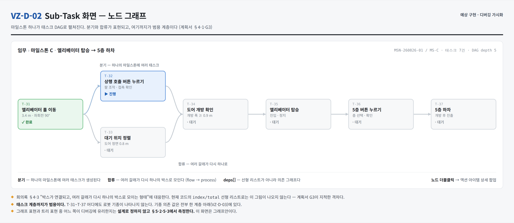
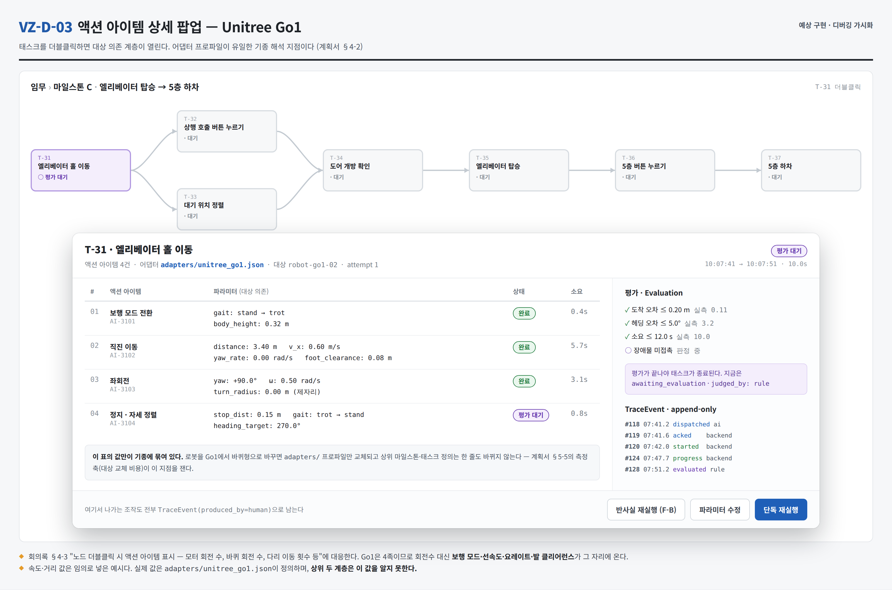
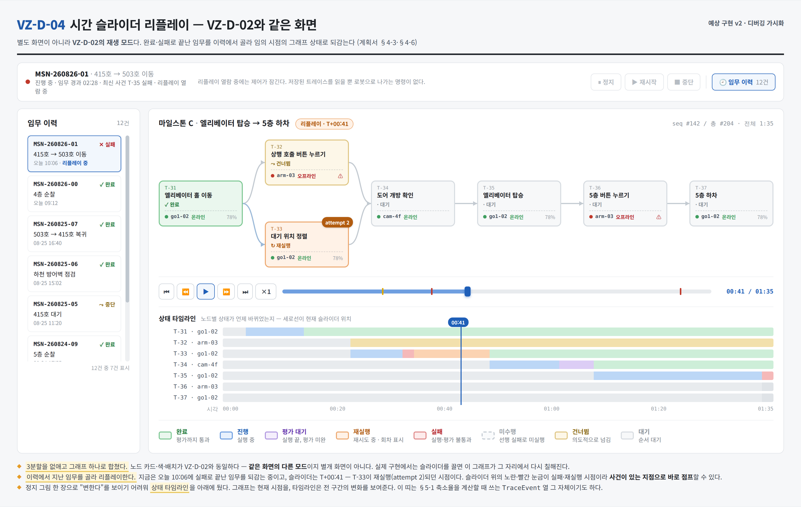
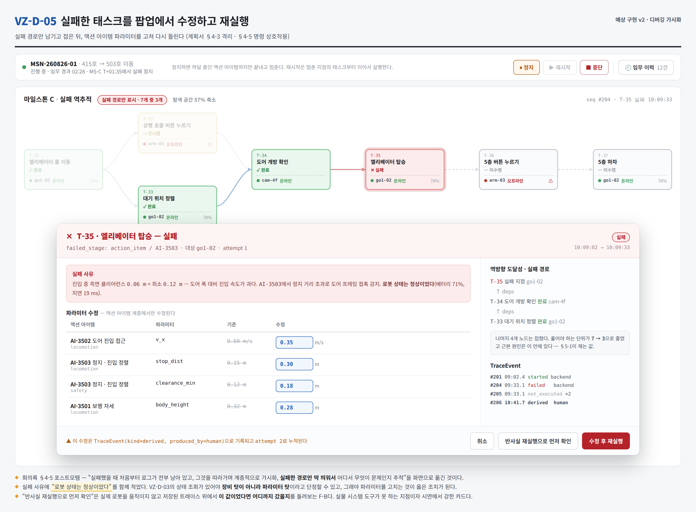

# 가시화 도구 구현 진행 계획

**작성**: 2026-08-26 · 김현우 · v1.0
**범위**: **가시화 도구를 어떻게 만들 것인가만** 다룬다. 논문 이야기는 `논문진행_디버깅가시화_260826.md`,
자세한 기술 선택과 코드 이식 판단은 `기술스택_가시화도구_260826.md`에 따로 있다.
**근거**: `260826_회의록.md` §4 (가시화 도구 설계 상세)

> 이 문서는 **읽고 바로 이해되는 것**을 목적으로 한다. 계약 스키마 필드나 파일 경로 같은 것은
> 기술 스택 문서로 넘겼다. 여기서는 "무엇을, 왜, 어떤 순서로, 언제까지"만 본다.

---

# 1. 한 문단 요약

로봇이 임무를 수행하다 실패했을 때 **어디서 왜 틀어졌는지 사람이 눈으로 따라갈 수 있는 도구**를 만든다.
임무를 마일스톤 → 태스크 → 액션 아이템의 세 계층으로 펼쳐 보여주고, 실행 기록을 전부 남겨서
실패한 시점으로 되감고, 실패한 경로만 남겨 좁혀 들어간다. 화면에서 파라미터를 고쳐 다시 돌려볼 수도 있다.

---

# 2. 왜 새로 만드는가 — 기존 프로토타입은 그대로 둔다

## 2-1. 결정

**새 폴더에서 새로 만든다. 기존 `web-dashboard/`는 손대지 않고 그대로 남긴다.**
필요한 부분만 골라 옮겨 온다.

## 2-2. 왜 얹지 않고 새로 만드는가

기존 프로토타입은 **"장치 상태를 실시간으로 보여주는 관제 화면"** 으로 만들어졌다.
이번에 만드는 것은 **"임무 실행 기록을 되짚어 실패를 찾는 도구"** 다. 겉모습은 비슷해 보여도
안쪽에서 다루는 것이 다르다.

| | 기존 프로토타입 | 새 가시화 도구 |
|---|---|---|
| 주로 다루는 것 | 지금 이 순간의 장치 상태 | 처음부터 쌓인 실행 기록 |
| 시간 개념 | 최신값만 있으면 된다 | **모든 시점을 되감을 수 있어야 한다** |
| 자료 구조 | 계획 → 구간의 2계층, 일렬 | 마일스톤 → 태스크 → 액션 아이템의 3계층, 갈래가 갈라지고 합쳐짐 |
| 화면이 답하는 질문 | "지금 정상인가?" | "**왜 실패했는가?**" |

기존 구조 위에 3계층과 기록 저장을 억지로 얹으면, 원래 잘 돌던 관제 화면까지 흔들린다.
기존 것은 이미 동작하고 검증 스크립트 5종이 통과하는 상태라 **그대로 두는 편이 안전하다.**

## 2-3. 그러면 기존 코드는 버리는가 — 아니다

**쓸 수 있는 것은 옮겨 온다.** 특히 다음 세 가지는 다시 만들 이유가 없다.

- **백엔드와 통신하는 부분** — 끊겼다 붙었을 때 구독을 자동으로 되살리는 로직까지 이미 있다.
- **명령을 내리고 응답을 짝지어 추적하는 부분** — 화면에서 "재실행" 버튼을 만들 때 그대로 쓴다.
- **계약 파일(스키마)과 검증 방식** — 데이터 모양을 코드가 아니라 파일로 못박아 두는 방식.
  새 도구도 같은 방식을 쓴다.

어떤 파일을 그대로 쓰고 어떤 파일을 고쳐 쓰는지는 **기술 스택 문서에 파일 단위로 정리**해 두었다.

## 2-4. 옮길 때 지키는 규칙 셋

1. **원본을 고치지 않는다.** 옮긴다는 것은 복사해서 새 폴더에서 고친다는 뜻이다.
   기존 폴더 파일은 한 줄도 바꾸지 않는다.
2. **기존 검증 5종은 계속 통과해야 한다.** 작업 중 언제 돌려도 통과해야 하고,
   깨지면 그건 원본을 건드렸다는 뜻이다.
3. **복사한 파일의 출처를 파일 맨 위에 적는다.** 나중에 원본이 고쳐졌을 때 무엇을 따라가야 하는지
   알 수 있어야 한다.

---

# 3. 무엇을 만드는가 — 일곱 덩어리

> **2026-08-27 추가** — AI 팀원이 논문 작업을 병행하게 되면서 **임무를 만드는 일(3-0)을 우리가 가져왔습니다.**
> 원래는 "AI가 만든 것을 받아서 그린다"였는데, 이제 **만드는 것부터 되짚는 것까지 한 레이어**입니다.

## 3-0. 임무 생성 *(신규 인수)*

발화 텍스트를 받아 실행할 것을 만듭니다.

```
발화 텍스트 → 마일스톤 쪼개기 → 태스크 생성 → 검증 → 액션 아이템 전개 → (실행) → 평가 판정
```

다섯 단계 모두 우리가 합니다. **다만 만드는 쪽과 검사하는 쪽은 코드를 나눕니다** —
생성기가 스스로를 검증하면 같은 오해를 두 번 반복할 뿐이고, 나눠 둬야 실패했을 때
생성 탓인지 검증 탓인지 가릅니다.

로컬 LLM에 의존하므로 **LLM이 없으면 생성만 멈추고 나머지는 계속 돌아야** 합니다.

**일정에 주는 영향**: 1단계(9/7 HCI 전달본)는 **그대로 목 데이터로 갑니다.**
생성기는 2단계에 넣습니다 — 여기 끌어오면 전달이 밀립니다.

## 3-1. 3계층 임무 모델

임무 하나를 세 계층으로 쪼개 보여준다.

```
임무          "415호에서 503호로 이동해줘"  (음성/텍스트에서 출발)
 └ 마일스톤   415호 → 복도 → 엘리베이터 → 5층 → 503호   ← 완전히 추상. 로봇 종류가 안 나온다
    └ 태스크   이동, 문 열기, 버튼 누르기, 재이동         ← 여기까지가 기종과 무관
       └ 액션 아이템   "3.4 m를 초속 0.6 m로 직진"        ← 여기서만 로봇 기종이 나온다
          └ 평가        도착 오차 0.2 m 이내인가          ← 통과해야 태스크가 끝난다
```

**중요한 경계 하나**: 태스크까지는 어떤 로봇에도 통하고, 액션 아이템부터 로봇 기종에 묶인다.
회의에서 합의된 내용이고, 이 도구에서는 **말로만 지키지 않고 검사로 막는다** —
마일스톤·태스크 자료에 모터니 바퀴니 하는 항목이 들어가면 검증 스크립트가 실패하도록 한다.

## 3-2. 실행 기록 저장소

무슨 일이 언제 일어났는지를 **한 줄씩 계속 덧붙이기만 하는 기록**으로 남긴다. 지우거나 고치지 않는다.

기록 한 줄에는 순번, 시각, 어느 계층의 무슨 노드인지, 무슨 일이 일어났는지(생성·하달·시작·진행·평가·실패·파생),
**그리고 그 일을 한 주체가 AI인지 백엔드인지 사람인지**가 들어간다.

마지막 항목이 핵심이다. 사람이 중간에 끼어들어 값을 고친 지점이 기록에 없으면,
나중에 되짚을 때 도구가 거짓말을 하게 된다.

## 3-3. 화면 — 계층을 따라 내려가기

마일스톤 목록에서 시작해서 클릭할수록 아래 계층으로 내려간다.
노드마다 색으로 상태를 표시하고, 실행 기록이 쌓이는 대로 색이 바뀐다.

상태는 여덟 가지다. 회의에서 나온 초록(완료)·빨강(실패) 외에
**"안 돌렸다"(건너뜀)와 "못 돌았다"(미수행)를 반드시 구분**한다. 디버깅에서 이 둘은 완전히 다른 단서다.

| 상태 | 뜻 |
|---|---|
| 대기 | 아직 순서가 안 왔다 |
| 진행 | 지금 돌고 있다 |
| 완료 | 평가까지 통과했다 |
| 평가 대기 | 실행은 끝났는데 평가가 안 끝났다 |
| 재실행 | 다시 돌리는 중이다 (몇 번째인지 함께 표시) |
| 실패 | 실행이나 평가가 통과하지 못했다 |
| 미수행 | 앞이 실패해서 **실행 자체가 일어나지 않았다** |
| 건너뜀 | 조건상 **일부러 넘겼다** |

## 3-4. 되감기 — 시간 슬라이더

기록이 남아 있으므로 임의의 시점 화면을 복원할 수 있다.
슬라이더를 끌면 그래프가 그 시점의 색으로 다시 칠해진다.
지난 임무를 목록에서 골라 되감을 수도 있다.

**이건 별도 화면이 아니라 같은 화면의 재생 모드다.**

## 3-5. 실패 경로만 남기기

실패한 노드에서 의존 관계를 거꾸로 따라가 **실패에 관여한 노드만** 남기고 나머지를 접는다.
회의에서 나온 "실패한 경로만 딱 띄워서 추적"이 이것이다.

7개 노드 중 3개만 남으면 사람이 볼 것이 절반 이하로 준다.
얼마나 줄었는지는 숫자로 잴 수 있고, 그 숫자가 논문의 근거가 된다 (논문 문서 참고).

## 3-6. 화면에서 고쳐 다시 돌리기

보기만 하는 도구가 아니라 **명령을 낼 수 있는 도구**로 만든다.

- 임무 정지 · 재시작 · 중단
- 실패한 태스크의 파라미터를 고쳐 재실행
- 액션 아이템 하나만 단독 실행
- 결함을 일부러 주입해서 실패를 재현
- 실제로 로봇을 움직이지 않고 **"이 값이었다면 어디까지 갔을까"만 돌려보기**

정지는 하달 중인 액션 아이템까지만 끝내고 멈춘다. 중간에 끊으면 로봇이 어중간한 자세로 남고,
그 상태는 기록으로 설명되지 않는다.

**여기서 나가는 조작도 전부 기록에 남는다.** 예외 없다.

---

# 4. 만드는 순서

## 4-1. 큰 흐름

```
0단계  준비          새 폴더 만들고, 무엇을 옮길지 정한다
   ↓
1단계  프로토타입 초안  화면 다섯 개가 목 데이터로 동작한다   ← HCI 팀원에게 전달할 물건
   ↓                          ↘
2단계  본체            기록 저장소 · 되감기 · 실패 경로 격리   [HCI 논의·반영]
   ↓
3단계  다듬기          결함 주입, 측정, 실제 데이터 연결
```

## 4-2. 단계별로 "끝났다"고 말할 수 있는 기준

| 단계 | 기간 | 만드는 것 | 끝났다는 기준 |
|---|---|---|---|
| **0. 준비** | 8/27~8/31 | 새 폴더 골격, 옮길 파일 목록 확정, 3계층 계약 초안 | 새 폴더에서 빈 화면이 뜬다 · 기존 검증 5종이 그대로 통과한다 |
| **1. 초안** | 9/1~9/7 | 화면 5종이 목 데이터로 클릭까지 동작 | **HCI 팀원에게 링크를 보낼 수 있다** |
| **2. 본체** | 9/8~9/28 | 기록 저장소, 시간 슬라이더, 실패 경로 격리, 명령 상호작용, **임무 생성기(§3-0)** | 실패를 만들면 경로가 좁혀지고, 슬라이더로 그 전 시점이 복원된다 · **발화 한 줄로 3계층이 만들어진다** |
| **3. 다듬기** | 9/29~10/12 | 결함 주입 하네스, 측정, HCI 논의 반영 | 결함 60건을 자동으로 돌려 숫자가 나온다 |
| **통합 (앞)** | **1단계 직후** | **탭 셸 · 상단 공통 바 · 공유 계층 경계 · 단독 빌드 타깃** | 탭 6개가 전환되고 탭⑥이 공유 계층을 통해서만 명령을 낸다 |
| **2·3단계** | — | 위 표의 2·3단계가 통합(앞) 뒤에 이어진다 | — |
| **통합 (뒤)** | 10월~ | 기존 탭 ①~⑤ 실제 이식 | 한 앱에서 탭 6개가 다 차고 **탭⑥ 단독 빌드도 그대로 뜬다** |
| **유지** | 11월~ | 시연 지원, 논문 실험 대응 | — |

## 4-3. 1단계를 9/7까지로 잡은 이유

HCI 팀원과의 협업이 **초안을 전달하는 데서 시작**하기 때문이다 (§5).
초안이 늦어지면 협업 전체가 그만큼 밀린다. 그래서 1단계는 **완성도가 아니라 속도**가 목표다.

1단계에서 하지 않는 것을 분명히 해 둔다.

- 실제 백엔드 연결 — 목 데이터로 충분하다
- 되감기·경로 격리 — 2단계
- 예쁘게 다듬기 — **팀원과 논의할 대상이므로 미리 다듬지 않는다**

---

# 5. HCI 팀원과의 협업

## 5-1. 진행 방식

```
① 내가 웹 프로토타입 초안을 만든다        (~9/7)
        ↓  실행 가능한 링크 + 화면 설명서
② 팀원에게 전달한다                        (9/8)
        ↓
③ UI 디자인 · 항목 배치를 논의한다         (9/8~9/14)
        ↓
④ 논의 결과를 반영한다                     (2단계와 병행)
        ↓
   필요하면 ②~④를 한 번 더
```

**빈손으로 만나지 않는다.** 만질 수 있는 초안이 있어야 "여기 항목이 너무 많다",
"이건 아래로 내리자" 같은 구체적인 이야기가 나온다.

## 5-2. 전달할 때 함께 보내는 것

1. 실행 가능한 초안 (링크 또는 실행 방법)
2. 화면 다섯 개가 각각 무엇을 하는 화면인지 한 장 설명
3. **논의하고 싶은 항목 목록** — 열린 질문으로 가면 두 배 걸린다

## 5-3. 논의하고 싶은 항목

1. **계층 전환** — 세 계층을 한 화면에 둘 것인가, 계층별로 전환할 것인가
2. **상태 여덟 개의 표시** — 색만으로는 여덟 개를 구분할 수 없다. 테두리 모양·아이콘·회차 배지를
   어떻게 조합할 것인가. 특히 **건너뜀과 미수행이 한눈에 구분**되어야 한다
3. **실패 경로 격리의 표현** — 나머지를 숨길 것인가, 흐리게 할 것인가, 접을 것인가
4. **되감기 조작** — 슬라이더 · 단계 이동 · 사건 지점 점프 중 무엇을 줄 것인가
5. **사용자 계층별 표시 깊이** — 비전문가에게 무엇을 감출 것인가
6. **하드웨어 배정 방식** — 드래그로 마일스톤에 놓는 방식이 자연스러운가
7. **명령 버튼의 배치** — 보는 화면에 실행 버튼을 섞을 때의 오조작 위험

## 5-4. 팀원 일정이 안 잡히면

초안은 어차피 만들어야 하는 것이므로 **내 진행은 막히지 않는다.**
전달만 해 두고 2단계를 계속하다가, 논의가 잡히면 그때 반영한다.
다만 논의가 늦어질수록 화면이 굳어 반영 비용이 커지므로, **9월 안에는 한 번 만나는 것을 목표**로 한다.

---

# 6. 화면 다섯 개

전체 이미지는 `reports/assets/2026-08-26_예상구현_VZ-D-0*.png` 에 있다.
다섯 장은 **하나의 임무를 서로 다른 시점에서 본 것**이라 시각과 상태가 서로 맞는다.

## 6-1. 마일스톤 화면



위쪽에 발화가 어디까지 처리됐는지 보여주는 막대(음성 수신 → 문자 변환 → 의도 분석 → 마일스톤 분리 →
태스크 생성)가 있고, 가운데에 마일스톤 목록, 오른쪽에 하드웨어 목록이 있다.
**하드웨어를 마일스톤 위로 끌어다 놓으면** 그 마일스톤의 태스크에 대상이 배정된다.

## 6-2. 태스크 노드 그래프



마일스톤 하나를 펼치면 태스크들이 그래프로 나온다. 갈래가 갈라지고 다시 합쳐진다.
노드마다 배정된 로봇과 연결 상태가 함께 뜨는데, 여기서 **아직 실패하지 않았지만 이대로 두면
실패할 태스크**가 미리 보인다 (예: 팔 로봇이 오프라인인데 버튼 누르기 태스크가 대기 중).

## 6-3. 액션 아이템 상세



태스크를 더블클릭하면 실제 명령값이 나온다. 로봇 상태(배터리·네트워크·IP·온도)도 여기서 조회한다.
**"코드가 틀렸나 장비가 문제인가"를 가르는 첫 질문**이 이 화면에서 끝나야 한다.

## 6-4. 시간 슬라이더 되감기



같은 그래프를 슬라이더로 되감는다. 아래 띠는 각 노드의 상태가 언제 바뀌었는지를 보여준다.

## 6-5. 실패 수정과 재실행



실패하면 관련 없는 노드가 접히고, 팝업에서 값을 고쳐 다시 돌린다.

---

# 6-6. 무엇까지 만들면 끝인가

**최종 모습은 탭 6개짜리 한 앱이다.** 기존 프로토타입을 폐기하지 않고 탭으로 이식하며,
지금 만드는 디버깅 도구가 그중 **탭⑥**이 된다. 전체 구조는 요구사항정의서 §3.1에 있고,
항목별 배치는 엑셀 `통합 앱 배치` 열에 표기했다.

```
① 구역 현황판  ② 제어 패널  ③ 지표 조회  ④ 영상 오버레이
⑤ 파이프라인 편집기(동결)   ⑥ 임무 설계 및 디버깅  ← 지금 만드는 것
```

**단계별로 무엇까지 만드는가.**

| 단계 | 범위 | 요구사항 |
|---|---|---|
| 0~3단계 | **탭⑥ + 공유 계층** | 탭⑥ 18건 + 공유 16건 = **34건** |
| 10월 | 기존 탭 ①~⑤ 이식 | 나머지 9건 (이미 구현되어 동작 중) |

탭⑥ 18건 — 디버깅 `VZ-D-01`~`08` · 생성 `VZ-G-01`~`05` · 음성 `VZ-L-01`~`03` ·
흡수 `VZ-U-03`(계층 뷰) · `VZ-U-07`(계획 승인·거부).

**0~3단계에서 만들지 않는 것**을 분명히 해 둔다 — 영상 스트림, 탐지 오버레이, 객체 추적,
관제 지표 패널, 감사 이력 패널, 파이프라인 편집기, Unity 트윈 렌더링. 전부 이미 동작하고
**10월에 탭으로 이식만** 한다. **요구사항 목록에 남아 있다고 해서 지금 만드는 것은 아니다.**

**지켜야 하는 것 셋.** ① 장치 상태 4종(탭①)과 태스크 상태 8종(탭⑥)은 다른 것이니 어휘를 가른다.
② 명령 출구는 하나다 — 탭②의 수동 제어와 탭⑥의 재실행이 같은 경로를 쓴다.
③ **탭⑥ 단독 빌드를 유지한다** — 논문 계측 측정에 다른 탭 부하가 섞이면 안 된다.

---

# 7. 지금 할 일 (8/27~8/31)

| 순서 | 할 일 | 왜 지금인가 |
|---|---|---|
| 1 | 새 폴더 골격 만들기 | 여기서 막히면 아무것도 못 한다 |
| 2 | 옮길 파일 목록 확정 (기술 스택 문서 §3) | 1단계 시작 전에 정해져 있어야 한다 |
| 3 | 3계층 계약 스키마 초안 | 화면보다 먼저다. 데이터 모양이 정해져야 화면을 그린다 |
| 4 | 기존 검증 5종 돌려서 통과 확인 | 작업 시작 전 기준선 |
| 5 | 연구실 PC에 Claude Code 원격 세팅 | 회의록 §5. 실험 서버로 쓴다 |

---

# 8. 확인이 필요한 것

- 새 폴더를 같은 저장소 안에 두는 것으로 진행한다 — 기존 `web-dashboard/`는 그대로 남는다. 이 방식이 맞는가.
- 1단계 초안을 **9/7까지, 완성도보다 속도**로 잡았다. HCI 팀원 일정에 맞는가.
- 하드웨어 배정을 마일스톤 단위로 두었는데, 태스크 단위까지 내려가야 하는 경우가 있는가.
- **임무 생성을 인수하면서 로컬 LLM 사양이 정해져야 한다.** 폐쇄망이 전제라 외부 API를 기본 경로로
  둘 수 없다. 연구실 PC에서 어느 규모 모델이 도는지 실측이 필요하다.
- 재생성 판단(사전조건이 깨졌을 때 다시 만드는 것)은 **확장점 E9로 분류해 이번 범위에서 뺐다.**
  전제가 깨지면 사용자가 임무를 중단하고 다시 발화하는 경로로 대신한다. 이 판단이 맞는가.
- 시연(UN·11월 육군)에서 이 도구가 담당할 범위. 시연 전용 개발이 따로 필요한가.
